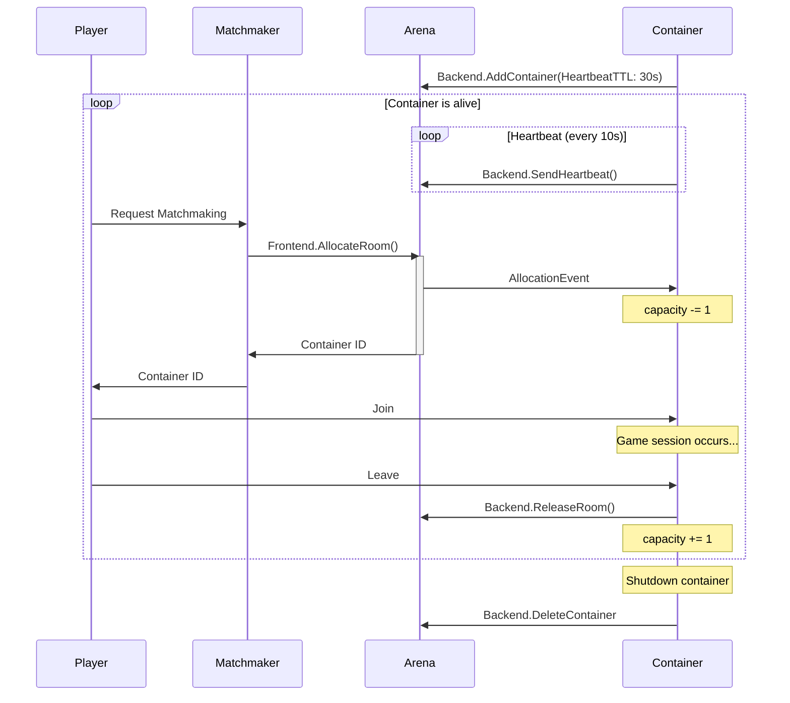

# Arena

Arena manages room allocations for multiplayer games.

Arena is designed for dynamically provisioning resources for stateful workloads such as dedicated game servers and AI inference backends. It provides a way to allocate **Rooms** - execution environments where these workloads run.

While [Agones](https://agones.dev/) serves a similar purpose in the open-source ecosystem, Arena operates independently of Kubernetes and can function in any environment. Of course, Arena can also be used alongside Agones when needed.

## Key concepts

A **Room** is the place where a single game session starts.
The process of starting a multiplayer game (e.g. Matchmaker) calls `Frontend.AllocateRoom` and returns the container ID to the player.

A **Container** is a place to store multiple rooms, usually an OS process or a Kubernetes Pod.
Containers provide their own ID and capacity at startup with `Backend.AddContainer`.
and also detect new room allocations via `AddContainerResponse.EventChannel`.

A **Fleet** is a group of Containers, and `Frontend.AllocateRoom` allows you to specify to which Fleet a Room is assigned.
You may have multiple Fleets depending on the environment and game type.

Each time a room is allocated, the capacity of the Container is decremented by 1.
When it reaches 0, the Container is full and cannot be allocated there.
However, when a room is freed by `Backend.ReleaseRoom`, the capacity is increased and the room can be allocated again.

Note that capacity here is the number of rooms, not the number of players.

## Heartbeat

To prevent invalid container information from remaining in Arena when containers crash, containers must periodically report their liveness using `Backend.SendHeartbeat`.

- Containers can specify a heartbeat TTL (Time To Live) when calling `Backend.AddContainer`
- If no TTL is specified, the default is 30 seconds  
- Containers should call `Backend.SendHeartbeat` at regular intervals (recommended: every 10 seconds for a 30-second TTL)
- If a container fails to send heartbeats within the TTL period, Arena automatically removes it from the available container pool

## License

MIT
