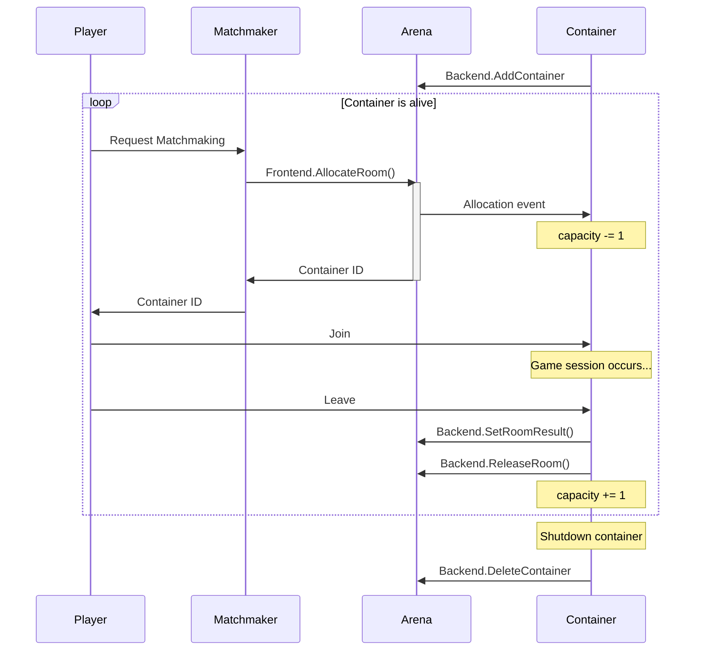

# Arena

Arena manages room allocations for multiplayer games.

A **Room** is the place where a single game session starts.
The process of starting a multiplayer game (e.g. Matchmaker) calls `Frontend.AllocateRoom` and returns the container ID to the player.

A **Container** is a place to store multiple rooms, usually an OS process or a Kubernetes Pod.
Containers provide their own ID and capacity at startup with `Backend.AddContainer`.
and also detect new room allocations via `AddContainerResponse.EventChannel`.

A **Fleet** is a group of Containers, and `Frontend.AllocateRoom` allows you to specify to which Fleet a Room is assigned.
You may have multiple Fleets depending on the environment and game type.

Each time a room is allocated, the capacity of the Container is decremented by 1.
When it reaches 0, the Container is full and cannot be allocated there.
However, when a room is freed by `Backend.ReleaseRoom`, the capacity is increased and the room can be allocated again.

Note that capacity here is the number of rooms, not the number of players.

## License

MIT
