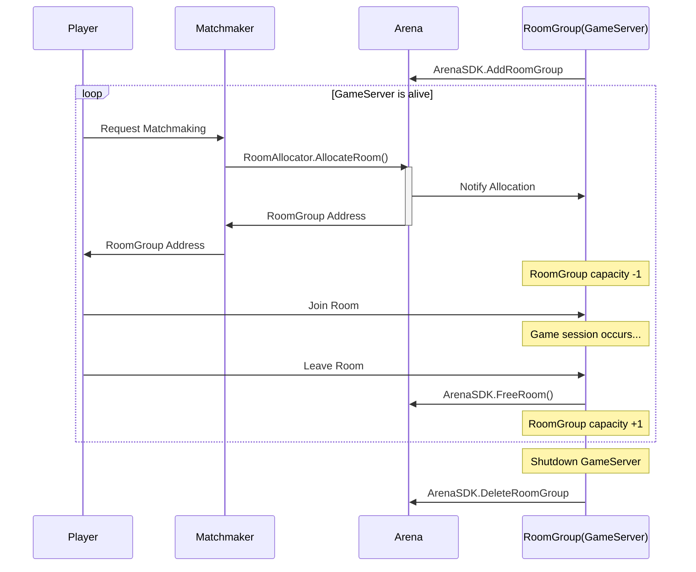

# Arena

Arena manages room allocations for multiplayer games.

A **Room** is the place where a single game session starts.
The process of starting a multiplayer game (e.g. Matchmaker) calls `RoomAllocator.AllocateRoom` and returns the address to the player.

A **RoomGroup** is a place to store multiple rooms, usually an OS process or a Kubernetes Pod.
RoomGroups provide their own address and capacity at startup with `ArenaSDK.AddRoomGroup`.
and also detect new room allocations via `AddRoomGroupResponse.EventChannel`.

Each time a room is allocated, the capacity of the RoomGroup is decremented by 1.
When it reaches 0, the RoomGroup is full and cannot be allocated there.
However, when a room is freed by `ArenaSDK.FreeRoom`, the capacity is increased and the room can be allocated again.

Note that capacity here is the number of rooms, not the number of players.

## Usage

Arena uses Redis as its backend, with [rueidis](https://github.com/redis/rueidis).
You can create the respective interfaces with `arenaredis.NewRoomAllocator` and `arenaredis.NewArenaSDK`.

## License

MIT