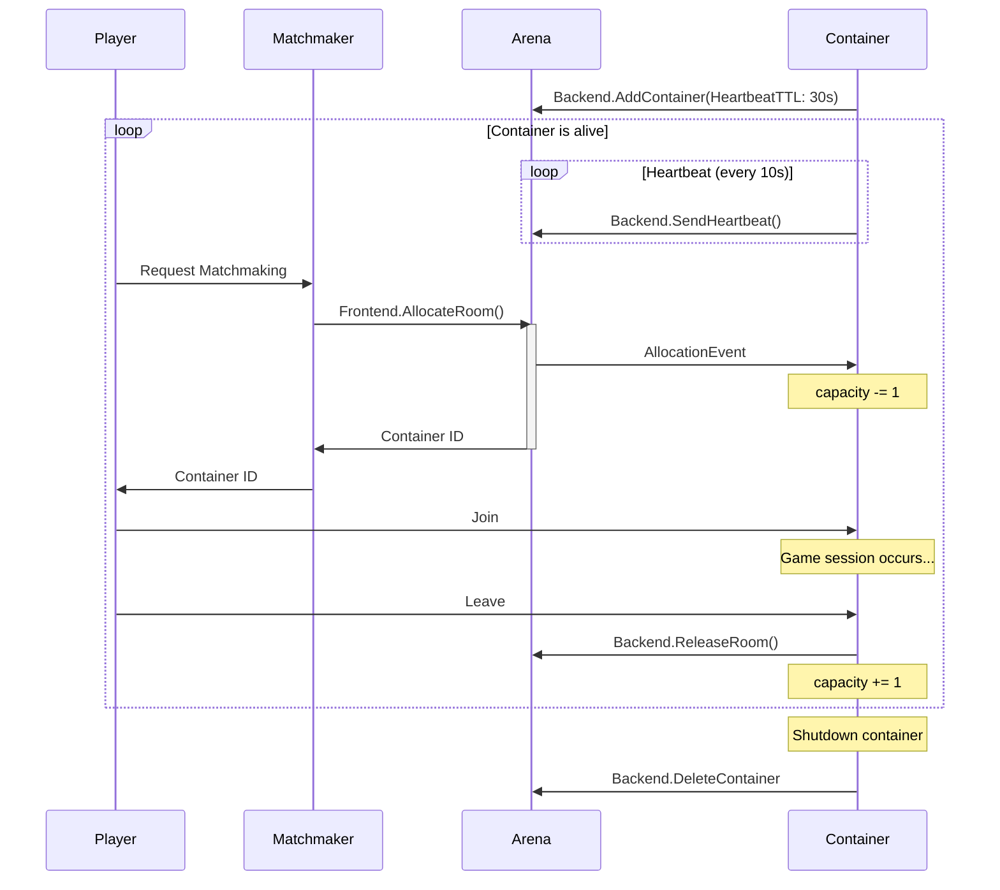

# Arena

Arena manages room allocations for multiplayer games.

Arena is designed for dynamically provisioning resources for stateful workloads such as dedicated game servers and AI inference backends. It provides a way to allocate **Rooms** - execution environments where these workloads run.

While [Agones](https://agones.dev/) serves a similar purpose in the open-source ecosystem, Arena operates independently of Kubernetes and can function in any environment. Of course, Arena can also be used alongside Agones when needed.

## Key concepts

A **Room** is the place where a single game session starts.
The process of starting a multiplayer game (e.g. Matchmaker) calls `Frontend.AllocateRoom` and returns the container ID to the player.

A **Container** is a place to store multiple rooms, usually an OS process or a Kubernetes Pod.
Containers provide their own ID and capacity at startup with `Backend.AddContainer`.
and also detect new room allocations via `AddContainerResponse.EventChannel`.

A **Fleet** is a group of Containers, and `Frontend.AllocateRoom` allows you to specify to which Fleet a Room is assigned.
You may have multiple Fleets depending on the environment and game type.

Each time a room is allocated, the capacity of the Container is decremented by 1.
When it reaches 0, the Container is full and cannot be allocated there.
However, when a room is freed by `Backend.ReleaseRoom`, the capacity is increased and the room can be allocated again.

Note that capacity here is the number of rooms, not the number of players.

```mermaid
sequenceDiagram
    participant Player
    participant Matchmaker
    participant Arena
    participant Container

    Container ->> Arena: Backend.AddContainer(HeartbeatTTL: 30s)
    loop Container is alive
        loop Heartbeat (every 10s)
            Container ->> Arena: Backend.SendHeartbeat()
        end
        Player ->> Matchmaker: Request Matchmaking
        Matchmaker ->> Arena: Frontend.AllocateRoom()
        activate Arena
        Arena ->> Container: AllocationEvent
        Note over Container: capacity -= 1
        Arena ->> Matchmaker: Container ID
        deactivate Arena
        Matchmaker ->> Player: Container ID

        Player ->> Container: Join
        Note over Container: Game session occurs...
        Player ->> Container: Leave
        Container ->> Arena: Backend.ReleaseRoom()
        Note over Container: capacity += 1
    end
    Note over Container: Shutdown container
    Container ->> Arena: Backend.DeleteContainer
```

## Heartbeat

To prevent invalid container information from remaining in Arena when containers crash, containers must periodically report their liveness using `Backend.SendHeartbeat`.

- Containers can specify a heartbeat TTL (Time To Live) when calling `Backend.AddContainer`
- If no TTL is specified, the default is 30 seconds  
- Containers should call `Backend.SendHeartbeat` at regular intervals (recommended: every 10 seconds for a 30-second TTL)
- If a container fails to send heartbeats within the TTL period, Arena automatically removes it from the available container pool

## Re-registration

A container may end up calling `Backend.AddContainer` more than once, typically when it retries after
an RPC timeout while the previous call already reached Arena. Such a retry must not be mistaken for a
restarted container: resetting the capacity would hand out slots that are in fact occupied, and
clearing the room mappings would leave the sessions running there unreachable.

To tell the two apart, containers set `AddContainerRequest.RegistrationID` to a value generated once
per container lifetime (e.g. a UUID) and send the same value on every retry.

- Same `RegistrationID` as the one Arena holds: the allocated rooms and the remaining capacity are
  kept, and only the event subscription is re-established
- Any other `RegistrationID`, including an empty one: the container is a new incarnation, so the
  rooms left by the previous one are removed and the capacity starts from `InitialCapacity`

Rooms are never removed from a container registering with `InitialCapacity` of 0, whatever its
`RegistrationID`. A container reporting no capacity states that its slots are taken, and that is the
only evidence of a running container Arena has left once the `RegistrationID` is unknown to it,
either because an older caller never stored one or because it expired along with the heartbeat.

`RegistrationID` must not be derived from a value that survives a restart, such as the container ID
or the Pod name. A restarted container reporting the `RegistrationID` of its predecessor keeps the
rooms of a session it no longer serves, and that capacity is freed only once its heartbeat lapses.
Rooms a container no longer serves are released with `Backend.ReleaseRoom`.

## License

MIT
